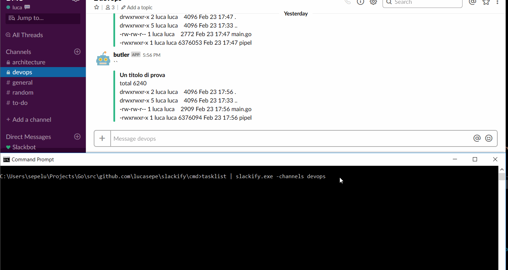

# Slackify

[](https://goreportcard.com/report/github.com/lucasepe/slackify)

> Upload files to your preferred Slack channels using CLI or pipe in stdin


# Download Binaries

https://github.com/lucasepe/slackify/releases



```
slackify 
-channels string
        Comma-separated list of channel names or IDs where the file will be shared (required)
-comment string
    A comment introducing the file to the specified channels (optional)
-file string
    The file you want to upload (optional)
-token string
    Authentication token bearing required scopes (required)
```

Upload a file to your Slack channel

```
slackify -channels devops \
   -file ./elastic-metrics.png \
   -comment "Hi crew, this is the actual report about app indices"
```

Pipe in stdin (linux example):
```
ps -a | slackify -channels devops
```

Pipe in stdin (windows example):
```
tasklist | slackify -channels devops
```

## Authentication token bearing required scopes

> This is the most important parameter and it's mandatory.

https://api.slack.com/docs/token-types#bot

Follow this steps to obtain your access token

1. Open the Slack Api App [link](https://api.slack.com/apps) and hit the `Create New App` button
2. Go to section `Add features and functionality`, select and create a new `Bots`
3. Then select `Permissions` and choose `bot permission scopes`
4. Install the newly created app to your workspace

Go to the `OAuth & Permissions` page and you will find your `Bot User OAuth Access Token`

- it starts with the prefix `xoxb-`

Once you have the access token you can pass it to slackify in two ways:

- define an environment variable `SLACKIFY_APP_TOKEN`
  - windows (powershell): `$env:SLACKIFY_APP_TOKEN="xoxb-.............."`
  - linux/osx : `export SLACKIFY_APP_TOKEN=xoxb-..............`

- pass it to slackify as parameter 
  - option: `--token="xoxb-................"`

# Download Binaries

https://github.com/lucasepe/slackify/releases

